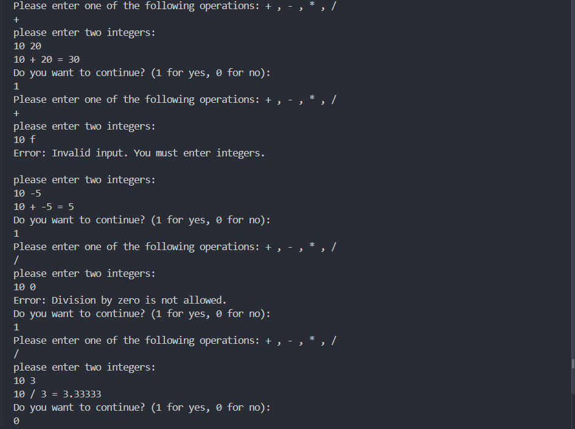

# Console Calculator

## 📝 Project Description
A simple, robust command-line calculator application written in C++. It performs basic arithmetic operations (addition, subtraction, multiplication, and division) on two integers. The application is built with strong input validation to prevent crashes from invalid user inputs (such as letters instead of numbers) and safely handles mathematical edge cases like division by zero. 

Users can perform multiple calculations continuously without needing to restart the application.

## ✨ Features
* **Core Operations:** Supports addition (`+`), subtraction (`-`), multiplication (`*`), and division (`/`).
* **Operator Validation:** Ensures the user only enters valid mathematical operators, prompting them to try again if an invalid character is entered.
* **Type Validation:** Safely clears and ignores non-integer inputs (like characters or strings) without trapping the user in infinite loops.
* **Division by Zero Handling:** Detects and prevents invalid division operations, displaying a friendly error message instead of crashing the program.
* **Accurate Division:** Casts integers to `double` during division to provide accurate decimal results (e.g., `10 / 3 = 3.33333`).
* **Continuous Execution:** Prompts the user to continue or exit after each calculation.

## 🛠️ Technologies Used
* **Language:** C++
* **Standard Libraries:** `<iostream>`, `<limits>`
* **Version Control:** Git & GitHub

## 🚀 How to Run It

1. **Clone the repository:**
   ```bash
   git clone [https://github.com/HossamSharaf/calculator.git](https://github.com/HossamSharaf/calculator.git)
   cd calculator
   ```
   ## Demo
   