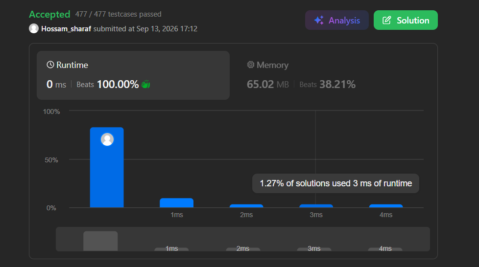

# Leetcode
## Username
Hossam_sharaf
## link profile
https://leetcode.com/u/Hossam_sharaf/
## Screenshot of Summation

## explanation
# Solution Idea
The solution relies on the Two Pointers technique. We initialize one pointer (left) at the beginning of the array and another pointer (right) at the end. We then swap the characters at these two positions. After swapping, we move the left pointer forward and the right pointer backward, moving them towards the center. This process repeats until the pointers meet or cross, effectively reversing the array in place.
# Complexity
Time Complexity: $O(N)$, where $N$ is the number of characters in the array. The algorithm iterates through half of the array (performing $N/2$ swaps), which simplifies to linear time.Space Complexity: $O(1)$. The algorithm only uses three extra variables (left, right, and temp) regardless of the input array's size. It modifies the input array directly, satisfying the constant extra memory requirement.